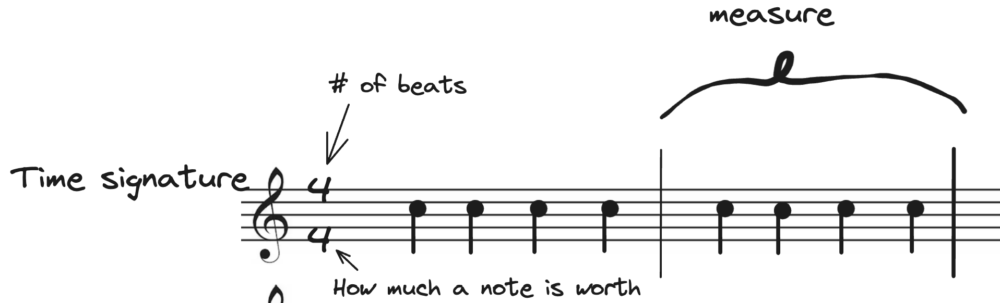
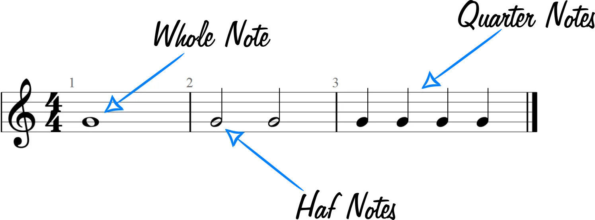

# Dance Music Theory

Understanding how you can interpret music as a dancer allows you to flourish in your creativity in regards to what you can do.

## Time Signature

In music, you have a time signature, which are the numbers on the left. MOST music will be in 4/4, where the top 4 tells you how many beats there are in a score and the bottom 4 tells you how much each note is worth.

Each note carries a different length (beat) in a measure. In the first example, a quarter note is worth 1 beat & a half note is worth two beats. Just want to let you know that music can be represented differently, and this is all you need to know about time signatures.

## Dividing Music

- Musicians like to organize their music into measures, where every 4 beats, there is a 'division'. Listen to basically any song and you can hear the beginning of each measure, it is a bit more prominent.
- As a dancer, we combine two measures together to make a complete _step_.
- Musicians tend to break their songs into 8 measures, or 4 steps, called _blocks_. These blocks are different parts of the stories in a song. In other words, they usually convey different emotions, and should be danced to a little differently.
- Sometimes musicians throw in an extra measure or two, which the musician puts into their song in order to signify a break in the song in some way. Maybe the song is very happy then BOOM, no it's sad. Or the song is very happy & PAUSE.
