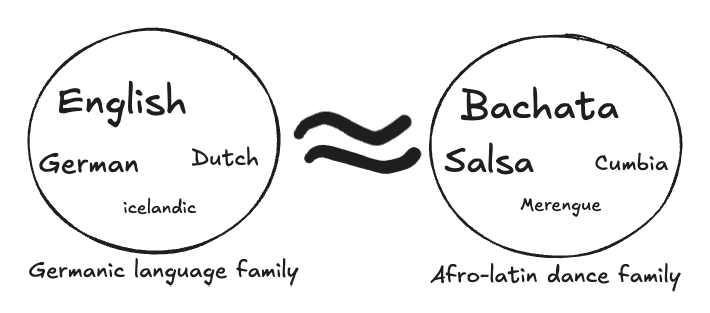
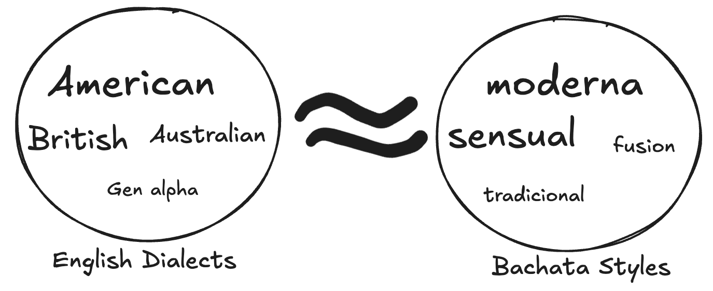
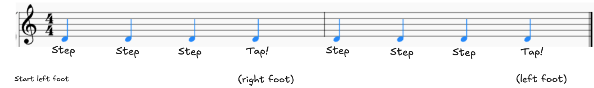

## Agenda

<!-- * Un baile - un minuto
* Etymology - 5 minutes
* Musicality  2 minutes
* The basic step - 30 minutes
* Demo - 2 minutes 30 seconds -->

<!-- I just showed you some bachata, but let's break down the art! -->

### The Etymology
English is a spoken language.
Dance is a non-verbal language.
So the same rules for etymology apply to dance as well.

The English languages lies in the germanic language family,
Whereas the Bachata dance style lies within the Afro-latin dance family.

Within English, there are different dialects, like Australian, British, etc.
Within Bachata, there are different styles, like Traditional, Moderna, Sensual, Fusion.

Today, we're going to learn modern bachata.

### The Musicality
We assume dance is just random moves, but there is soooo much structure!

Bachata the music genre is made in 4/4.
Within the **dance**, 2 sets of 4 counts make up a beat.

This is the basic step!

